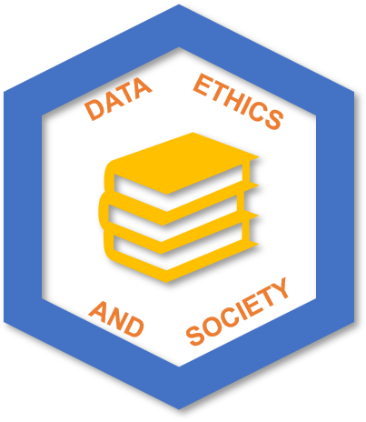

# Data Ethics and Society Reading Group

_“Data Science isn’t neutral”;_ books such as Race After Technology, Invisible Woman and Data Feminism have highlighted the social and ethical impact of Statistics, Data Science and Artificial Intelligence (AI).

The Data Ethics and Society Reading Group is a space for public sector colleagues to reflect on the ethical implications of our work. We read books, journals, blog posts, and watch videos, that relate to doing data science ethically. Read our code of conduct [here](./code-of-conduct.md).

We meet (virtually) four times a year.

> Stay tuned for details of changes to the reading group for 2025.

While you're here, you may also want to:

* enjoy our [reading list](./READING-LIST.md).
* [read our code of conduct](./code-of-conduct.md)
* [suggest reading materials](#how-to-make-suggestions).
* [see details of previous sessions](./SESSIONS.md).
* [get involved in organising](#get-involved).
* [contact us](mailto:xgov-data-ethics@proton.me)

## Stay in the loop

Join our [mailing list](https://xgovdataethics.substack.com/) to hear about upcoming events.

We also hang out in the :sparkles: :arrow_right: [**#ethics** :arrow_left: :sparkles: channel of the cross-government data science slack workspace](https://govdatascience.slack.com).

## Get Involved

If you're interested in joining us in organising, take a look at our [facilitating](./Guides/facilitating.md) and [organising](./Guides/organising.md) guides to see if it might be for you. Get in touch via [email](mailto:xgov-data-ethics@proton.me) if so- we would really welcome new organisers!

Interested in starting your own group at your organisation? All resources included in this repo are available under the terms of the [license](./LICENSE).

## How to make suggestions

If you'd like to make a suggestion for what to read, please do so however you prefer:

* [add a suggestion to our Google Forms](https://forms.gle/qvNVX1681hkW62Lj9)
* [make an issue](https://github.com/ukgovdatascience/data-ethics-and-society-reading-group/issues/new/choose) - use the suggestion(s) template.
* make a Pull Request (PR) on [our repository](https://github.com/ukgovdatascience/data-ethics-and-society-reading-group)
* contact us via [email](mailto:xgov-data-ethics@proton.me)

Suggestions will be viewed by the organisers and several times a year we will ask those signed-up to our [mailing list](https://xgovdataethics.substack.com/) to vote on a book to be read at a futute event.

---

## Attendance

This group is exclusively for the UK public sector (central and local government and their arms-length bodies, government companies, policing and public health organisations, such as the NHS).

The organisers are based in Leeds and Cardiff.

### Frequently Asked Questions

* Can I use a personal email address to register and access the event on Microsoft Teams?

> Please register with your work address to help us check that you are a UK public sector employee. If you use a personal email address, your registration may be cancelled.

* How do you make your events accessible to all attendees?

> Microsoft Teams provides a live captioning feature for attendees to use. We encourage our speakers to design slides with accessibility in mind, and we will try our best to send the slides in advance.

* If you have any suggestions or requests regarding accessibility features, please [email](mailto:xgov-data-ethics@proton.me) us.

---

## Acknowledgements

Built off of, inspired by, and borrowing heavily from:

* [Ethics Book Club in a
Box](https://github.com/DataKind-UK/data-ethics-book-club-in-a-box) from [DataKind UK](https://datakind.org.uk/): an intro to setting up a data ethics book club.
* [Data Ethics Club](https://github.com/very-good-science/data-ethics-club)

## Contributors

<!-- ALL-CONTRIBUTORS-LIST:START - Do not remove or modify this section -->
<!-- prettier-ignore-start -->
<!-- markdownlint-disable -->

<!-- markdownlint-restore -->
<!-- prettier-ignore-end -->

<!-- ALL-CONTRIBUTORS-LIST:END -->

### Emoji Key

This project follows the [all-contributors](https://github.com/all-contributors/all-contributors) specification, with some small tweaks to fit our purposes!  We use...

* 🖋  for submitting suggestions to the "reading" list (suggestions can be any medium!)
* 💬  for leading the discussion in a meeting
* 📋  for organising
* 🤔  for ideas and planning of the group
* 🎨  for visual design (e.g. logo)
* 🚧  for repository maintenance (e.g. fixing links)

## License

Unless stated otherwise, this is released under the [MIT License](./LICENSE).
