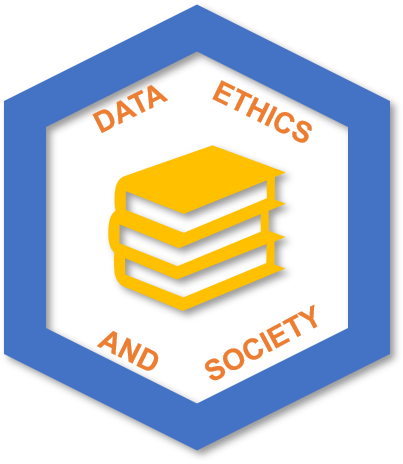
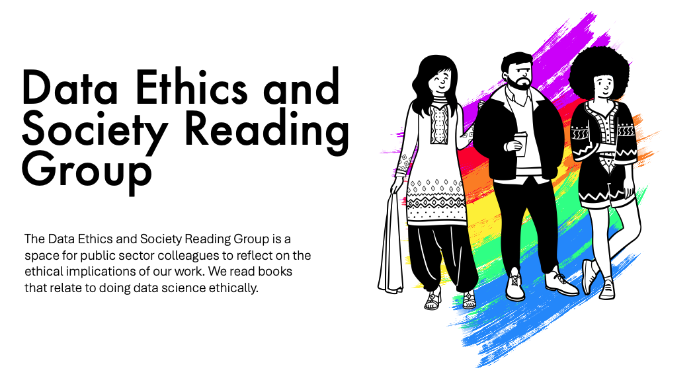
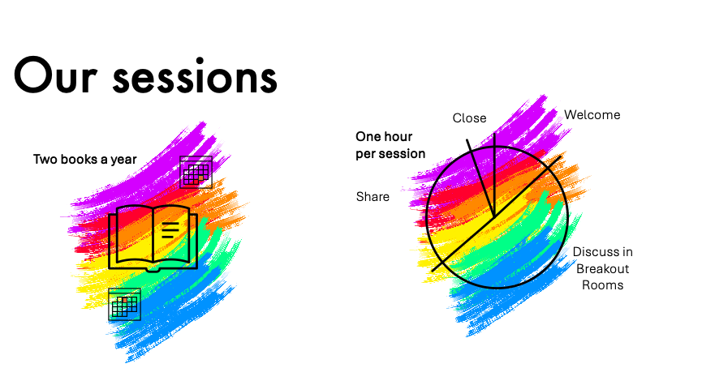

<a href="https://data-ethics-and-society.github.io/data-ethics-and-society-reading-group">Home</a> 
- <a href="https://data-ethics-and-society.github.io/data-ethics-and-society-reading-group/SESSIONS.html">Sessions</a> 
- <a href="https://data-ethics-and-society.github.io/data-ethics-and-society-reading-group/Guides/guides.html">Guides</a> 
- <a href="https://data-ethics-and-society.github.io/data-ethics-and-society-reading-group/code-of-conduct.html">Code of Conduct</a> 
- <a href="https://data-ethics-and-society.github.io/data-ethics-and-society-reading-group/READING-LIST.html">Reading List</a>

_“Data Science isn’t neutral”;_ books such as Race After Technology (2019), Invisible Woman (2019) and Data Feminism (2020) have highlighted the social and ethical impact of Statistics, Data Science and Artificial Intelligence (AI).

## Next session

> 📖 Our next sessions will be on [Tuesday 29 April and Wednesday 14 May 2025 to discuss Supremacy by Parmy Olson](./Sessions/2025/04-25-session.md)
>
> ➡️ [SIGN UP HERE](https://www.tickettailor.com/events/dataethics/1549481?/r/github)

## Who are we?

The Data Ethics and Society Reading Group is a space for public sector colleagues to reflect on the ethical implications of our work. We read books that relate to doing data science ethically. You can [contact us on xgov-data-ethics@proton.me](mailto:xgov-data-ethics@proton.me).

> :memo: Read our code of conduct [here](./code-of-conduct.md).

## How do our events work?

We organise and sessions to cover two books a year. You can see what we have read previously on our [reading list](./READING-LIST.md). Have a suggestion? Add it to our [reading materials](#how-to-make-suggestions). Our sessions are typically an hour long, including breakout rooms.

> :tv: [Watch our short 4-minute video](https://youtu.be/nuWOeRx26iw) or read our [facilitating](./Guides/facilitating.md) guide to understand what to expect at a session.

## Stay in the loop

Join our Substack [mailing list](https://xgovdataethics.substack.com/) to hear about upcoming events.

We also hang out in the :sparkles: :arrow_right: [**#ethics** :arrow_left: :sparkles: channel of the cross-government data science slack workspace](https://govdatascience.slack.com).

## Get Involved

If you're interested in joining us in organising, take a look at our [facilitating](./Guides/facilitating.md), [organising](./Guides/organising.md) and [tools](./Guides/tools.md) guides to see if it might be for you. Get in touch via [email](mailto:xgov-data-ethics@proton.me) if so.

Interested in starting your own group at your organisation? All resources included in this repo are available under the terms of the [license](./LICENSE).

## How to make suggestions

If you'd like to make a suggestion for what to read, please do so however you prefer:

* [add a suggestion to our Google Forms](https://forms.gle/qvNVX1681hkW62Lj9)
* [make an issue](https://github.com/ukgovdatascience/data-ethics-and-society-reading-group/issues/new/choose) - use the suggestion(s) template.
* make a Pull Request (PR) on [our repository](https://github.com/ukgovdatascience/data-ethics-and-society-reading-group)
* contact us via [email](mailto:xgov-data-ethics@proton.me)

Suggestions will be viewed by the organisers and several times a year we will ask those signed-up to our [mailing list](https://xgovdataethics.substack.com/) to vote on a book to be read at a futute event.

## Attendance

This group is exclusively for the UK public sector (central and local government and their arms-length bodies, government companies, policing and public health organisations, such as the NHS).

### Frequently Asked Questions

* Can I use a personal email address to register and access the event on Microsoft Teams?

> Please register with your work address to help us check that you are a UK public sector employee. If you use a personal email address, your registration may be cancelled.

* How do you make your events accessible to all attendees?

> Microsoft Teams provides a live captioning feature for attendees to use. We encourage our speakers to design slides with accessibility in mind, and we will try our best to send the slides in advance.

* If you have any suggestions or requests regarding accessibility features, please [email](mailto:xgov-data-ethics@proton.me) us.

---

## Acknowledgements

Built off of, inspired by, and borrowing heavily from:

* [Ethics Book Club in a
Box](https://github.com/DataKind-UK/data-ethics-book-club-in-a-box) from [DataKind UK](https://datakind.org.uk/): an intro to setting up a data ethics book club.
* [Data Ethics Club](https://github.com/very-good-science/data-ethics-club)

## Contributors

<!-- ALL-CONTRIBUTORS-LIST:START - Do not remove or modify this section -->
<!-- prettier-ignore-start -->
<!-- markdownlint-disable -->
<table>
  <tbody>
    <tr>
      <td align="center" valign="top" width="14.28%"><a href="https://github.com/AI-ynnna"> <b>Adela Iliescu</b></a> <a href="#maintenance-AI-ynnna" title="Maintenance">🚧</a> <a href="#talk-AI-ynnna" title="Talks">📢</a> <a href="#promotion-AI-ynnna" title="Promotion">📣</a> <a href="#content-AI-ynnna" title="Content">🖋</a> <a href="#review-AI-ynnna" title="Reviewed Pull Requests">👀</a> <a href="#ideas-AI-ynnna" title="Ideas, Planning, & Feedback">🤔</a> <a href="#doc-AI-ynnna" title="Documentation">📖</a></td>
      <td align="center" valign="top" width="14.28%"><a href="https://github.com/asfass"> <b>Alessandra Fassio</b></a> <a href="#content-asfass" title="Content">🖋</a></td>
      <td align="center" valign="top" width="14.28%"><a href="https://github.com/alexander-newton"> <b>Alexander Newton</b></a> <a href="#content-alexander-newton" title="Content">🖋</a></td>
      <td align="center" valign="top" width="14.28%"><a href="https://github.com/harrietrs"> <b>Harriet Sands</b></a> <a href="#content-harrietrs" title="Content">🖋</a> <a href="#doc-harrietrs" title="Documentation">📖</a> <a href="#eventOrganizing-harrietrs" title="Event Organizing">📋</a> <a href="#talk-harrietrs" title="Talks">📢</a> <a href="#ideas-harrietrs" title="Ideas, Planning, & Feedback">🤔</a> <a href="#promotion-harrietrs" title="Promotion">📣</a> <a href="#question-harrietrs" title="Answering Questions">💬</a> <a href="#video-harrietrs" title="Videos">📹</a> <a href="#review-harrietrs" title="Reviewed Pull Requests">👀</a> <a href="#maintenance-harrietrs" title="Maintenance">🚧</a></td>
      <td align="center" valign="top" width="14.28%"><a href="https://github.com/HillaryJuma"> <b>Hillary Juma</b></a> <a href="#design-HillaryJuma" title="Design">🎨</a> <a href="#talk-HillaryJuma" title="Talks">📢</a> <a href="#promotion-HillaryJuma" title="Promotion">📣</a> <a href="#content-HillaryJuma" title="Content">🖋</a> <a href="#ideas-HillaryJuma" title="Ideas, Planning, & Feedback">🤔</a></td>
      <td align="center" valign="top" width="14.28%"><a href="https://github.com/mshodge"> <b>Michael Hodge</b></a> <a href="#design-mshodge" title="Design">🎨</a> <a href="#maintenance-mshodge" title="Maintenance">🚧</a> <a href="#talk-mshodge" title="Talks">📢</a> <a href="#promotion-mshodge" title="Promotion">📣</a> <a href="#content-mshodge" title="Content">🖋</a> <a href="#review-mshodge" title="Reviewed Pull Requests">👀</a> <a href="#ideas-mshodge" title="Ideas, Planning, & Feedback">🤔</a> <a href="#doc-mshodge" title="Documentation">📖</a> <a href="#video-mshodge" title="Videos">📹</a></td>
      <td align="center" valign="top" width="14.28%"><a href="https://github.com/annie-howard"> <b>annie-howard</b></a> <a href="#content-annie-howard" title="Content">🖋</a> <a href="#talk-annie-howard" title="Talks">📢</a></td>
      <td align="center" valign="top" width="14.28%"><a href="https://github.com/amelianoonan1-nhs"> <b>amelianoonan1-nhs</b></a> <a href="#content-amelianoonan1-nhs" title="Content">🖋</a></td>
    </tr>
  </tbody>
</table>

<!-- markdownlint-restore -->
<!-- prettier-ignore-end -->

<!-- ALL-CONTRIBUTORS-LIST:END -->

### Emoji Key

This project follows the [all-contributors](https://allcontributors.org/) specification, and its [Emoji Key](https://allcontributors.org/docs/en/emoji-key).

## License

Unless stated otherwise, this is released under the [MIT License](./LICENSE).
