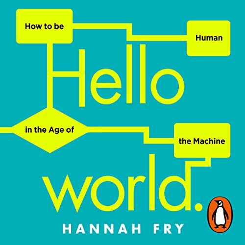

<a href="https://data-ethics-and-society.github.io/data-ethics-and-society-reading-group">Home</a> 
- <a href="https://data-ethics-and-society.github.io/data-ethics-and-society-reading-group/SESSIONS.html">Sessions</a> 
- <a href="https://data-ethics-and-society.github.io/data-ethics-and-society-reading-group/Guides/guides.html">Guides</a> 
- <a href="https://data-ethics-and-society.github.io/data-ethics-and-society-reading-group/code-of-conduct.html">Code of Conduct</a> 
- <a href="https://data-ethics-and-society.github.io/data-ethics-and-society-reading-group/READING-LIST.html">Reading List</a>

# Data Ethics & Society Reading Group 15-02-22, [12:00-13:00 GMT](https://www.timeanddate.com/countdown/generic?p0=136&iso=20220215T12&msg=Data%20Ethics%20and%20Society%20Reading%20Group%3a%20Hello%20World)

## Meeting info

### Description

You're welcome to join us for the first of the 2022 Data Ethics & Society Reading Group sessions, on Tuesday the 15th February 2022 at [12:00-13:00](https://www.timeanddate.com/countdown/generic?p0=136&iso=20220215T12&msg=Data%20Ethics%20and%20Society%20Reading%20Group%3a%20Hello%20World).

We will be discussing [Hannah Fry's Hello World: How to be Human in the Age of Machines](https://hannahfry.co.uk/book/hello-world/). _It’s a book about how we’ve slowly handed over control to computers – how there are algorithms and artificial intelligence hiding behind almost every aspect of our modern lives – and what that means for our society._

> Please consider either buying the book from a local, independent bookseller, or picking up a used copy online.

Thank you to Harriet for suggesting this events content.

### Discussion points

- What did you think of the book?
- How would we know self driving cars have become better at driving than humans?
- Do you agree with Hannah that "Having an algorithm - even an imperfect algorithm - working with judges to support their often faulty cognition is [...] a step in the right direct"?
- Can you think of an example of an algorithm that has a net benefit to society?

---

<!--

## Meeting notes

### Who came
Number of people: 32

-->
