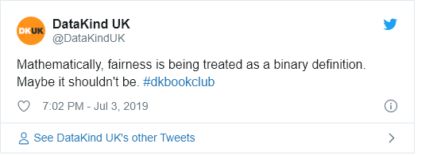

Fairness in AI
================

## Materials

### Materials for Book Club

**How do we define fairness?**

  - [21 Fairness definitions](https://fairmlbook.org/tutorial2.html) and
    their politics - Arvind Narayanan, 2018 \[video; 1hr\]

  - DataKind UK’s Giselle Cory wrote a
    [blog](https://medium.com/datakinduk/defining-fairness-1e12586d4b36)
    summarising and reflecing on Narayanan’s work, launched ahead of the
    book club.

**Background**

  - [Machine
    Bias](https://www.propublica.org/article/machine-bias-risk-assessments-in-criminal-sentencing)
    - the Propublica COMPAS story that is the key reference point in
    talks about algorithmic bias and unfair outcomes \[article\]
  - [Where fairness
    fails](https://static1.squarespace.com/static/5b8ab61f697a983fd6b04c38/t/5cd9934e9b747a265111e80a/1557762900322/Where+fairness+fails+data+algorithms+and+the+limits+of+antidiscrimination+discourse.pdf):
    data, algorithms, and the limits of antidiscrimination discourse \*
    Anna Lauren Hoffman, 2019 \[academic article\]

**Hands on**

  - [IBM AI
    Fairness 360](https://www.ibm.com/blogs/research/2018/09/ai-fairness-360/)
    tool \[blog + links to interactive tutorials\]

### Further Reading

## Questions

### Facilitator Prompt Questions

## Outputs

### Live Tweets/Commentary

For tweets from the evening see
[here](https://twitter.com/search?q=\(%23dkbookclub%20OR%20%23dkethicsbookclub\)%20until%3A2019-07-04%20since%3A2019-07-02&src=typed_query&f=live)

<!-- -->

### Blogs

[**No fair: How can we guarantee fairness in
AI?**](https://medium.com/datakinduk/no-fair-how-can-we-guarantee-fairness-in-ai-e13c92befe42)

## Feedback

## Notes or other comments
