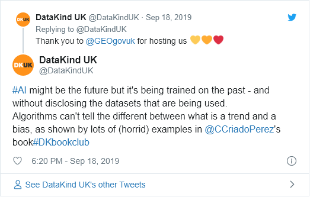
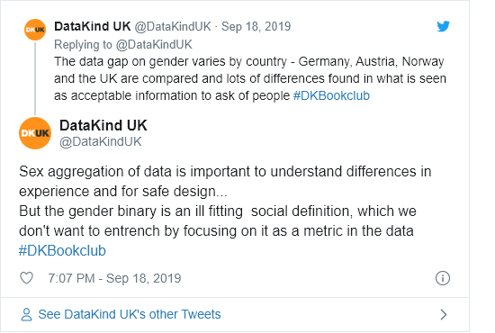

AI and Gender
================

## Materials

### Materials for Book Club

Think that discussing the ethics and impacts of data science is
important, but also, kind of fun? Our next data science ethics bookclub
is on *AI and gender* and we’d love you to join the discussion. **You
are welcome to pick from this reading list, depending on your interest
and the time you have:**

**Book** : [Invisible Women: Data Bias in a World Designed for
Men](https://www.goodreads.com/book/show/41104077-invisible-women) by
Caroline Criado Pérez

**News article** : “[The deadly truth about a world built for men – from
stab vests to car
crashes](https://www.theguardian.com/lifeandstyle/2019/feb/23/truth-world-built-for-men-car-crashes)”
by Caroline Criado Pérez

*Crash-test dummies based on the ‘average’ male are just one example of
design that forgets about women – and puts lives at risk*

**Journal article** : [The Misgendering
Machines](https://ironholds.org/resources/papers/agr_paper.pdf):
Trans/HCI Implications of Automatic Gender Recognition by Os Keyes

*Automatic Gender Recognition (AGR) is a subfield of facial recognition
that aims to algorithmically identify the gender of individuals from
photographs or videos. In wider society, the technology has proposed
applications in physical access control, data analytics and advertising.
Within academia, it is already used in the field of Human-Computer
Interaction (HCI) to analyse social media usage…I show that AGR
consistently operationalises gender in a trans-exclusive way, and
consequently carries disproportionate risk for trans people subject to
it.*

**Report** : I'd blush if I could: closing gender divides in digital
skills through education by Unesco - *specifically we're looking
at*[Think Piece 2 - The Rise of Gendered AI and its Troubling
Repercussions](https://unesdoc.unesco.org/ark:/48223/pf0000367416.page=85),
pages 85-146

**News article** : [“Digital assistants like Siri and Alexa entrench
gender biases, says
UN”](https://www.theguardian.com/technology/2019/may/22/digital-voice-assistants-siri-alexa-gender-biases-unesco-says)
by Kevin Rawlinson

*Assigning female genders to digital assistants such as Apple's Siri and
Amazon's Alexa is helping entrench harmful gender biases, according to a
UN agency.*

### Further Reading

  - Gender and AI in the workplace
    [link](https://ainowinstitute.org/discriminatingsystems.pdf)

## Questions

### Facilitator Prompt Questions

**Warming up**

  - What was your main takeaway from the readings?

  - Can you think of an item or product in your life, that was designed
    for the opposing gender? Tip: Think of your daily routine. Think of
    how you could redesign this so it becomes more inclusive.

**The gender data gap**

  - Why has the gender data appeared? Is it rooted in misogyny (intended
    to deliberately harm of ignore women) or an absence of thought?

  - What do you feel needs to be done to reduce, even eliminate this
    gender gap?

  - The author, Perez believes we need to start collection
    sex-disaggregated data. Do you agree? Why, or why not?

**Data, AI and gender**

  - *Invisible women* places a focus on a binary concept of gender (male
    and female). How we can ensure inclusive design for all - not just
    those identifying with binary genders? Discuss the limitations of
    *Invisible Women* with regards to this.
  - Automatic Gender Recognition - assuming a gender based on features
    in the data - often ignores trans individuals and others who are
    non-binary. What can/should be done to avoid this? In what
    situations does AGR have an overall beneficial use case?

**Data science x social activism**

  - The following statement argues that our awareness of data gaps only
    goes so far, and that we need more to lead to change. Discuss\!

*“The power of data to shame people into making society fairer, it
seems, goes only so far. Beyond a certain point, it's difficult not to
conclude that they don't particularly care. What should worry us more
than the data gap, then, is that huge and seemingly intractable
don't-give-a-damn gap.”* - Invisible Women by Caroline Criado Perez –
review, The Observer, 2019

## Outputs

### Live Tweets/Commentary

For tweets from the evening see
[here](https://twitter.com/search?q=\(%23dkbookclub%20OR%20%23dkethicsbookclub\)%20until%3A2019-09-19%20since%3A2019-09-17&src=typed_query&f=live).

<!-- --><!-- -->

### Blog

[AI and gender: the ‘default male’ and the unspoken gender
binary](https://medium.com/datakinduk/ai-and-gender-the-default-male-and-the-unspoken-gender-binary-d9df9a5ff9ad)

## Feedback

## Notes or other comments
