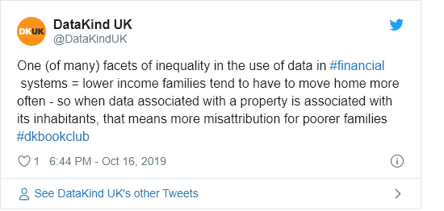
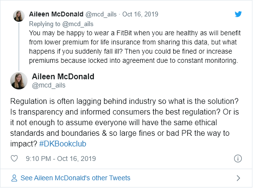

AI & bad credit: the impact of automation on financial inclusion
================

## Materials

### Materials for Book Club

Our next data science ethics bookclub is on *AI and bad credit: the
impact of automation on financial inclusion.* **You are welcome to pick
from this reading list, depending on your interest and the time you
have:**

  - \*\*Blog: ‘\*\* We Didn't Explain the Black Box – We Replaced it
    with an Interpretable Model’, about the FICO explainable credit
    score competition winner
    [here](https://community.fico.com/s/blog-post/a5Q2E0000001czyUAA/fico1670)
  - **Academic article** on fairness in credit risk evaluation,
    ‘Context-conscious fairness in using machine learning to make
    decisions’
    [here](https://sigai.acm.org/static/aimatters/5-2/AIMatters-5-2-07-Lee.pdf)
  - **Government paper** : The Centre for Data Ethics and Innovation
    look at AI and Personal Insurance
    [here](https://www.gov.uk/government/publications/cdei-publishes-its-first-series-of-three-snapshot-papers-ethical-issues-in-ai/snapshot-paper-ai-and-personal-insurance)
  - **News article** on how companies can use data with low levels of
    regulation, ‘The new lending game, post-demonetisation’
    [here](https://tech.economictimes.indiatimes.com/news/technology/the-new-lending-game-post-demonetisation/56367457)
  - **Academic article** on discrimination in consumer lending
    [here](https://faculty.haas.berkeley.edu/morse/research/papers/discrim.pdf)

### Further Reading

  - <https://www.fca.org.uk/publication/research/price_discrimination_in_financial_services.pdf>

  - <https://www.fca.org.uk/publication/feedback/fs19-04.pdf>

## Questions

### Facilitator Prompt Questions

**Note:** Questions are based on \[CDEI meeting\]
\](<https://twitter.com/peterkwells/status/1178597424669089792/photo/1>)

**Warm up**

  - Which of the papers from the recommended reading list did you read?
    What were your main takeaways?
  - What are the main benefits of data science & AI into the financial
    sector? Prompts (if conversation is slow:
      - More efficient financial markets
      - Increased access to financial products e.g fin tech innovation,
        or existing finance services
      - Faster access to financial products
      - Personalised services e.g. AI powered chatbots
      - Detecting vulnerable groups earlier to provide support
      - Better detection of economic crime- fraud/money laundering
      - Increased detection of cyber threats
      - Increase finance services efficiency
      - Better risk assessment therefore low costs for customers
      - Efficient compliance (regulatory technology)
  - Who are the beneficiaries? Which group benefits the most

**Negative consequences?**

  - What do you think some of the major risks within financial services
    sector arising from the application of data driven technology and
    AI? Prompts (if conversation is slow:
    
      - Cyber attacks
      - Extreme market movement (algorithms used to automate trade
        decisions) & difficulties monitoring algorithmic trade (black
        box)
      - Lack of transparency
      - Lack of explainability
      - Loss of public trust in financial systems
      - Use of non traditional finance data e.g social media encroaches
        on privacy
      - Digital exclusion- what about people who don't use digital- they
        don't create lots of data\!
      - Preferential access to people who are willing to give lots of
        data e.g. provide car/fitness sensors to insurers
      - Bias due to use of historical data to predict forwards
      - Consumer disempowerment- asymmetric power as financial services
        know more about a customer than the customer itself
      - Regulators unable to keep up with AI due to lack of resources
      - Algorithmic collusion (outside of the financial institution)
      - Increased surveillance of finance workers
      - Deskilling of financial workers/ workers have excessive trust in
        algorithmic recommendations
      - Data monopolies
      - Fear of potential risks reduces AI takeup which could be a
        benefit
      - Excessive data retention
      - Increased inequality
      - Non-alignment with societal goals

  - How do these risks arise?

  - Which groups are most affected and how?

  - 
**General discussion question**

  - Consider yourself/family/friends as a consumer (e.g. for credit, car
    insurance, health insurance). What data would you share? What would
    be your concerns about its use? What would you want to know about a
    company's decision (explainability etc)? And - how should this be
    regulated/controlled? How have the reading materials and discussion
    so far changed how you thought about any of this?

**Governance**

  - What governance is or should be in place to mitigate for negative
    consequences?
      - Legislation and regulation
      - Technical solutions (can lead to discussions around fairness-
        see Michelle Lee's article)
      - Soft governance (standards and codes)
      - Anything else?

## Outputs

### Live Tweets/Commentary

For tweets from the evening see
[here](https://twitter.com/search?q=\(%23dkbookclub%20OR%20%23dkethicsbookclub\)%20until%3A2019-10-17%20since%3A2019-10-15&src=typed_query&f=live).

<!-- --><!-- -->

### Blog

[How do we leverage the possibilities of AI for greater financial
inclusion?](https://medium.com/datakinduk/how-do-we-leverage-the-new-opportunities-of-ai-for-greater-financial-inclusion-a8a326fd7f3b)

## Feedback

## Notes or other comments
